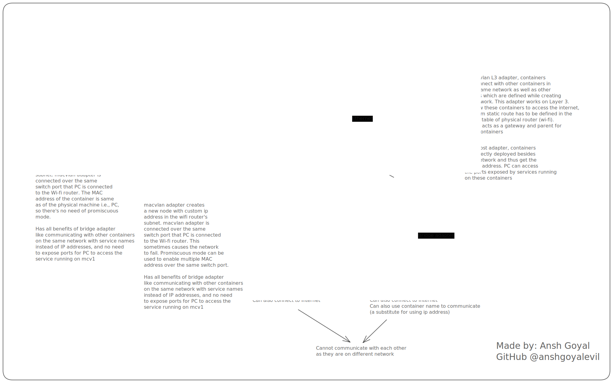

## Docker Networking Explained



There are basically 7 types of networks in Docker. They are:

- Bridge
- Host
- Macvlan
- Macvlan 802.1q
- Ipvlan L2
- Ipvlan L3
- Overlay
- None (Not really a network)

### Bridge

Create network:

```bash
sudo docker network create -d bridge my-bridge-network
```

Create container:

```bash
sudo docker run -itd --rm --name my-bridge-container --network my-bridge-network alpine
```

### Host

```bash
sudo docker network create -d host my-host-network
```

Create container:

```bash
sudo docker run -itd --rm --name my-host-container --network my-host-network alpine
```

### Macvlan

```bash
sudo docker network create -d macvlan \
--subnet=<Host_Subnet(192.168.146.0/24)> \
--gateway=<Host_Gateway(192.168.146.244)> \
-o parent=<Host_Interface(enp0s3)> \
my-macvlan-network 
```

Create container:

```bash
sudo docker run -itd --rm --network my-macvlan-network \
--ip <IP_in_the_Same_Subnet(192.168.146.90)> \
--name my-macvlan-container alpine
```

### Macvlan (802.1q)

```bash
sudo docker network create -d macvlan \
--subnet=<Host_Subnet(192.168.146.0/24)> \
--gateway=<Host_Gateway(192.168.146.244)> \
-o parent=<Host_Interface(enp0s3.20)> \
my-macvlan20-network 
```

Currently, I have no information on how to create and use a container with this network.

### Ipvlan L2

```bash
sudo docker network create -d ipvlan \
--subnet=<Host_Subnet(192.168.146.0/24)> \
--gateway=<Host_Gateway(192.168.146.244)> \
-o parent=<Host_Interface(enp0s3)> \
my-ipvlan-network 
```

Create container:

```bash
sudo docker run -itd --rm --network my-ipvlan-network \
--ip <IP_in_the_Same_Subnet(192.168.146.92) \
--name my-ipvlan-l2-container alpine
```

### Ipvlan L3

```bash
sudo docker network create -d ipvlan \
--subnet=<New_Subnet(192.170.146.0/24)> \
-o parent=<Host_Interface(enp0s3)> -o ipvlan_mode=l3 \
--subnet=<New_Subnet_To_Connect_To(192.172.146.0/24)>
my-ipvlan-network 
```

Create container:

```bash
sudo docker run -itd --rm --network my-ipvlan-network \
--ip <IP_in_the_Same_Subnet(192.168.146.92) \
--name my-ipvlan-l3-container alpine
```

### Overlay

Currently, I have no information for this.